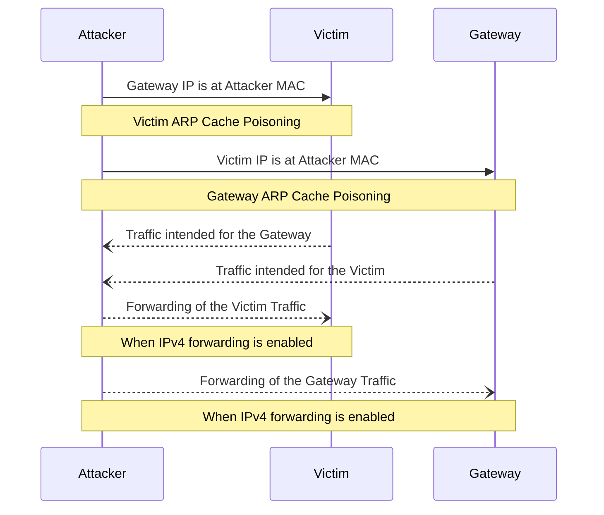

<br /><br /><br /><br />
<p align="center">
  
</p>
<br /><br />

# arp-spoofer
> A command-line tool to easily run a man-in-the-middle attack leveraging ARP cache poisoning.

[](https://app.travis-ci.com/HQarroum/arp-spoofer)
[](https://www.codefactor.io/repository/github/hqarroum/arp-spoofer)
[](https://deepsource.io/gh/HQarroum/arp-spoofer/?ref=repository-badge)

Current version: **1.0.0**

## 📋 Table of content

- [Installation](#-install)
- [Description](#-description)
- [Usage](#-usage)
- [Dependencies](#-install)
- [See Also](#-see-also)

## 🚀 Install

```bash
cargo install arp-spoofer
```

## 🔰 Description

> This command-line tool has been primarily built for educational purposes and as a mean to develop a meaningful project in order to learn [Rust](https://www.rust-lang.org/). It is by no means production material, but has meaningful comments throughout the code to document the different steps and design decisions made to build this tool.

`arp-spoofer` is a portable, synchronous ARP cache poisoning command-line tool written in Rust that provides an easy way to perform man-in-the-middle attack on a local Ethernet-based network segment. It only requires the IP address of the target to attack, and the IP address of the default gateway on the network.

An ARP cache poisoning attack leverages design weaknesses in the [ARP protocol](https://en.wikipedia.org/wiki/Address_Resolution_Protocol) with which an attacker can corrupt the ARP cache of remote victims by abusing Victim's ARP caches, making victims believe that the attacker's IP address is associated with the MAC address of a different computer. Therefore, by sending specially crafter ARP packets on an Ethernet-based local area network, it is relatively easy to deceive victims and have them sending all their packets to the attacker's computer instead of the default network gateway.

Below is a simplified representation of how an attacker poisons the cache of the victim and the gateway and how the traffic flows between the different elements when IPv4 forwarding is enabled.



## 📘 Usage

The usage of `arp-spoofer` is quite easy, the only information that needs to be supplied are :

- The local network interface to use to perform the attack.
- The IP address of the victim.
- The IP address of the default network gateway.

> Note that the ARP cache of both the victim and the default network gateway will be altered when running this tool. By interrupting the tool by pressing `ctrl-c`, it will attempt to restore the ARP cache of both the victim and the default network gateway to their original values.

### Attacking a remote host

You can initiate an attack by running `arp-spoofer` as shown below.

```bash
arp-spoofer \
  --interface <network-interface> \
  --target <victim-ip> \
  --gateway <gateway-ip>
```

`arp-spoofer` will automatically attempt to resolve the MAC address of both the victim and default network gateway by issuing legitimate ARP requests on the network. It will then craft spoofed ARP packets to poison the cache of the victim - tricking it into believing the attacker is the default gateway - and of the gateway - tricking it into believing the attacker is the victim. This way all bi-directional traffic from the victim to the gateway (and from the gateway to the victim) will transit via the attacker's network interface.

> You can monitor the packets from the victim in transit via the attacker's network interface using a tool such as [Wireshark](https://www.wireshark.org/).

## 📦 Dependencies

Below is a list of the main external crates which `arp-spoof` depends on.

Name                                         | Version | Description
-------------------------------------------- | ------- | -----------
[`pnet`](https://github.com/libpnet/libpnet) | 0.35.0  | libpnet is used as a way to build, send and receive packets on the datalink layer.
[`clap`](https://github.com/clap-rs/clap)    | 4.5.17 | clap is used as a command-line argument management library.
[`indicatif`](https://github.com/console-rs/indicatif) | 0.17.8 | indicatif is used as a console output management library.
[`ctrlc`](https://github.com/Detegr/rust-ctrlc) | 3.4.5 | ctrlc is used to portably register hooks on ctrl-c.

## 👀 See Also

- The [ARP Protocol](https://en.wikipedia.org/wiki/Address_Resolution_Protocol) Wiki page.
- The [ARP Spoofing](https://en.wikipedia.org/wiki/ARP_spoofing) Wiki page.
- The [ARP Spoofer](https://github.com/EONRaider/Arp-Spoofer) tool.
